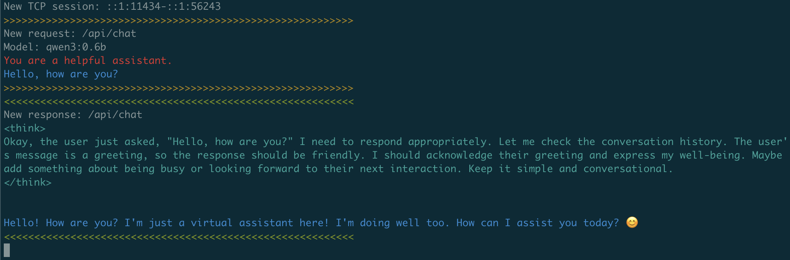

# localdumper

想要抓包各种Agent的提示词，使用本地的大模型程序比如ollama和lmstudio等。

之前尝试过几种方案：

- 程序调试日志，存在两个问题：OLLAMA_DEBUG之前可以后来不行了，消息看不全；不支持格式化和高亮（需要手动复制配置jq）
- burp代理抓包，存在两个问题：一个是有些客户端不支持配置代理；另一个是在推理时间比较长的情况下，burp由于不支持sse的动态响应，必须一次response获取完成才会进行响应，导致客户端超时；
- wireshark抓包分析：手动操作太复杂，需要follow tcp，然后手动复制文本；也不支持格式化和高亮显示

综合下来，我的需求是，在使用任何AI/Agent客户端对接本地ollama或者lmstuido等产品的API时，能够抓取提示词（系统提示词和用户提示词），并且支持格式化和高亮显示。

## 需求

- [x] 非侵入式抓包，无需做任何系统和软件配置，不影响使用的AI/Agent客户端
- [x] 支持HTTP原始报文的高性能抓取，提取完整的request和response原始内容
- [x] 作为框架SDK，提供通知事件的接口，方便上层做UI展示
  - 事件通知支持OnRequest/OnResponse
  - 事件通知参数可以通过ID来关联一次请求和响应
- [x] 命令行颜色支持
  - [x] 请求
    - [x] 系统提示词
    - [x] 用户提示词
  - [x] 响应
    - [x] 响应
    - [x] 工具调用
    - [x] 工具响应内容
- [ ] 桌面UI支持
  - [ ] 紧凑型布局
  - [ ] 支持列表和详情展示
  - [ ] 支持多语言切换
  - [ ] 支持主题切换
  - [ ] 支持抓包网卡、过滤器等配置
  - [ ] 支持显示过滤器
  - [ ] 支持高亮和格式化：JSON/XML/NDJSON/CSS/HTML

## 命令行

### promptdumper

- [x] 支持ollama
  - [x] 支持 /api/chat
  - [x] 支持 /api/generate
- [x] 支持openai compatible api，包括ollama和lmstudio的兼容api
  - [x] 支持 /v1/chat/completions
  - [x] 支持 /v1/completions
- [ ] 支持lmstudio
  - [ ] 支持 /api/v0/chat/completions
  - [ ] 支持 /api/v0/completions

### 截图

## 限制

- 只支持TCP协议，不支持UDP（HTTP3）
- 只支持HTTP报文，不支持HTTPS协议，后续可能考虑通过代理的方式来支持中间人解密